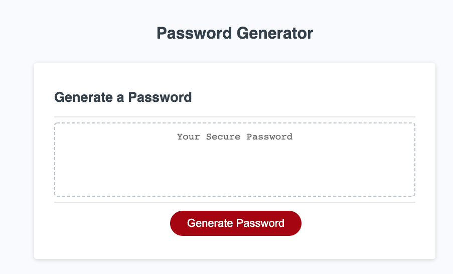
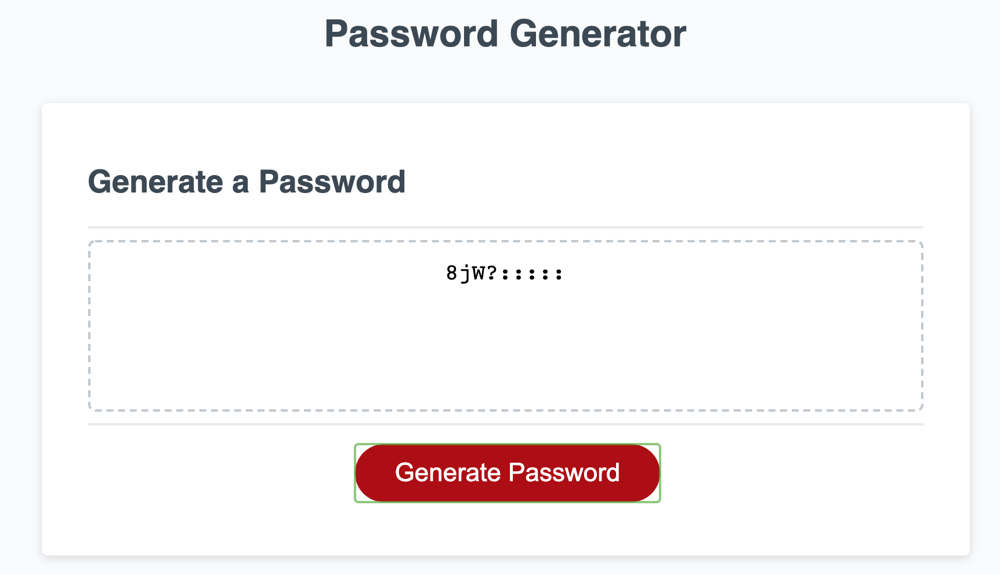

# Password Generator

## Description

The Password Generator is an application that an employee can use to generate a random password based on criteria they’ve selected by modifying starter code.  It will have a clean and polished user interface that is responsive, ensuring that it adapts to multiple screen sizes.

- Repository: https://github.com/bridgetrshannon/Password_Generator
- Page: 
https://bridgetrshannon.github.io/Password_Generator/ 

## Features
- This app runs in the browser with dynamically updated HTML and CSS powered by JavaScript.
- Users can have a password generated for them based on criteria they choose (number of characters, uppercase letters, lowercase letters, numbers, and/or special characters).

